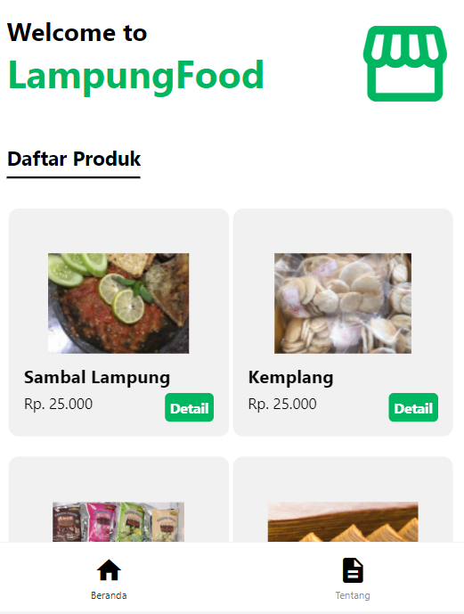
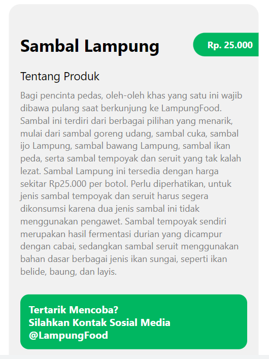

## LampungFood
### (Oleh-Oleh Khas Lampung)
Aplikasi Lampung Food merupakan aplikasi yang berisikan tentang produk makanan oleh-oleh khas lampung. Aplikasi ini menampilkan beberapa elemen dari produk seperti nama, gambar, harga, dan deskripsi. Aplikasi ini dikembangkan untuk memenuhi tugas UAS Pengembangan Aplikasi Mobile.

Nama Anggota :
- Adam Taufiqurrahman           118140065
- Muhammad Nadhif Athalla       119140209
- Muhammad Fariz Luthfi         119140199
- Muhammad Faatih Rizal Auliya  119140212

### Fungsi Aplikasi
Terdapat banyak sekali oleh-oleh berupa makanan khas Lampung berupa makanan yang wajib dicicipi ketika berkunjung ke lampung, seperti tempoyak, sambal, kemplang, kue engkak, keripik pisang, pie pisang, kopi, dan lain lain.
Manfaat dari adanya website ini yaitu memudahkan pendatang dari luar Lampung untuk mengetahui apa saja makanan makanan khas yang ada di lampung dan dengan mudah mengetahui di mana lokasinya berada. Selain itu dengan adanya website ini kita dapat mengetahui daftar harga makanan yang ada, sehingga dapat menyesuaikan dengan keadaan ekonomi kita.

Berikut merupakan tampilan halaman utama dari website LampungFood :

Pada halaman ini terdapat daftar produk beserta harganya. Terdapat juga tombol detail yang apa bila di klik maka akan muncul tampilan yang mendeskripsikan makanan tersebut, harganya, dan juga dimana kita bisa mendapatkan makanan tersebut beserta kontak yang dapat dihubunginya.

Berikut ini adalah tampilan dari halaman detail :

### Sumber Data
Sumber data aplikasi ini adalah API yang berisi data oleh-oleh di LampungFood yang dibentuk sendiri. Dokumentasinya bisa dilihat pada link berikut : https://api-pam.herokuapp.com/

### Petunjuk Penggunaan
Berikut adalah cara untuk menggunakan aplikasi LampungFood :
1.	Mendownload file .apk pada link berikut : https://drive.google.com/file/d/1BvtXdMLVVRMEFoVHB9E1uUWTcLGDI3SM/view?usp=sharing 
2.	Pastikan sudah terdapat aplikasi tersebut didalam ponsel android anda
3.	Install aplikasi tersebut
4.	Jika menjalankan aplikasi menggunakan file javascript yang ada di repo github, silahkan menginstall beberapa depedencies yang terlampir dibawah
5.	Setelah masuk ke aplikasi anda bisa melihat lihat oleh" apa yang ingin anda cari
6.	Anda bisa klik detail untuk detaill informasi dari produk tersebut
7.	Lalu di bagian detail juga terdapat harga dari produk tersebut serta kontak sosial media yang bisa dihubungi untuk mendapatkan produk tersebut
8.	Selamat menikmati dan mohon maaf apabila terdapat ketidaksempurnaan dalam pengembangan aplikasi

List Dependecies :
- "@expo/webpack-config": "~0.16.2",
- "@react-native-community/masked-view": "^0.1.11",
- "@react-navigation/bottom-tabs": "^6.3.1",
- "@react-navigation/material-bottom-tabs": "^6.2.1",
- "@react-navigation/native": "^6.0.10",
- "@react-navigation/stack": "^6.2.1",
- "expo": "~45.0.0",
- "expo-status-bar": "~1.3.0",
- "expo-updates": "~0.13.1",
- "react": "17.0.2",
- "react-dom": "17.0.2",
- "react-native": "0.68.2",
- "react-native-gesture-handler": "^2.2.1",
- "react-native-reanimated": "^2.8.0",
- "react-native-safe-area-context": "^4.2.4",
- "react-native-screens": "^3.11.1",
- "react-native-vector-icons": "^9.1.0",
- "react-native-web": "0.17.7",
- "webpack-dev-server": "~3.11.0"

